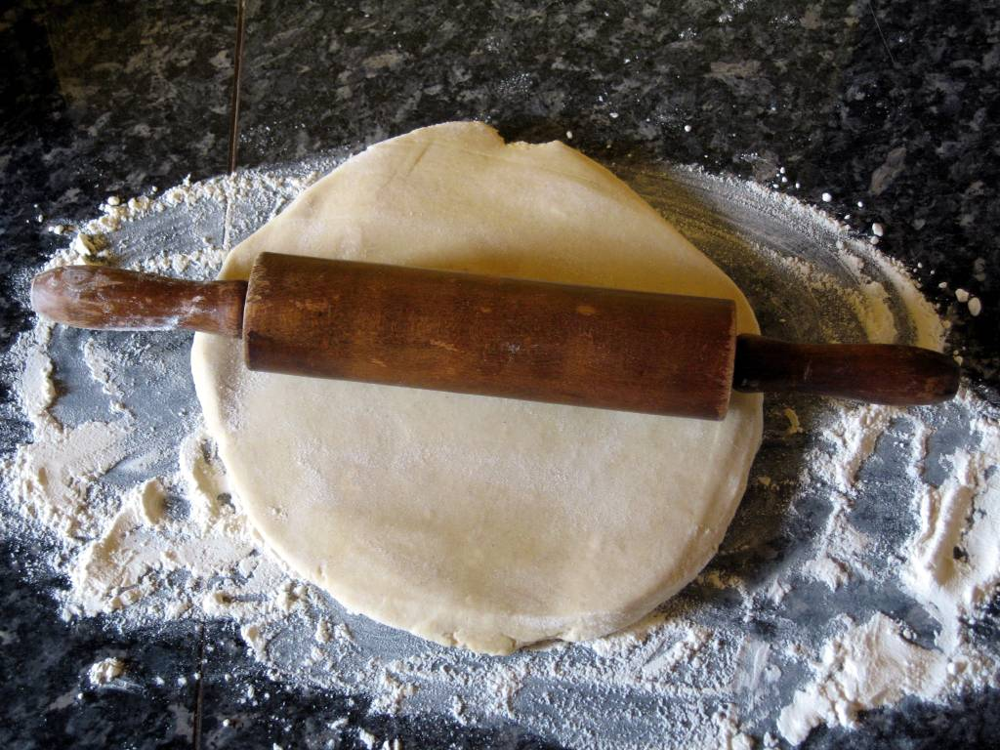

# Pâte brisée

## Ingrédients

+ 250g farine
+ 0,8 dl beurre fondu
+ 0,8 dl eau
+ 1 pincée de sel

## Marche à suivre
1. Mettre le tout dans un bol
2. Ne pas pêtrir
3. Ajouter un peu de farine si trop humide et un peu de beurre fondu ou de l'eau si trop sec
4. Faire une boule et etaler

